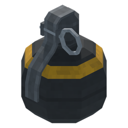
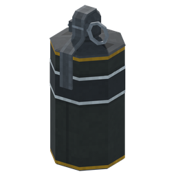
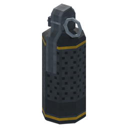
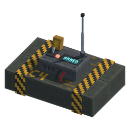
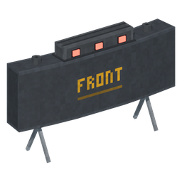
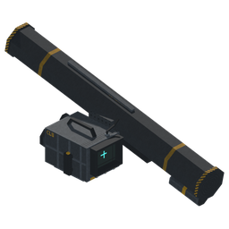
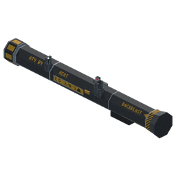
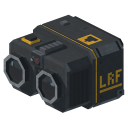

# BombsAway!

Grenades, explosives, rocket launchers and a pair of binoculars that call in artillery and air strikes, all for FRUKT.

Every explosion is simulated. Fragments fly as real projectiles, the pressure wave travels outward and wounds what it reaches, and walls give cover.

---

## What You Get

Eight new items on their own **Bombs Away** shelf in the inventory. Put them on your toolbar and left click.

### Throwables & Charges
- **Frag Grenade:** Pull, throw, take cover.
- **Smoke Grenade:** Five colours. The smoke drifts with the wind, rolls around corners, and explosions blow holes through it.
- **Flashbang:** Blinds and deafens anyone looking at it, or at a wall it lights up. That includes you. Bobs throw their hands over their eyes and ears.
- **C4:** Sticks to anything, including Bobs. Place as many as you like and set them off from a distance, one by one or all at once.
- **Claymore:** Set it down and walk away. Anything that crosses its laser tripwires gets the front of it.

### Launchers
- **Javelin:** Raise the command launch unit, which has working day, night and thermal views, and lock on. The missile climbs high and dives onto the target from above.
- **AT-4:** Shoulder it, aim down the iron sights, fire. Mind the backblast. The spent tube gets tossed and a fresh one comes up.
- **Three warheads for both:** HEAT for punching through, HE for a big blast, and thermobaric for clearing rooms.

### Binoculars: Fire Support
Laze a target and call it in:
- **Artillery:** 155 mm barrages, 81 mm mortars, smoke screens, illumination flares and precision-guided shells.
- **Air support:** A-10 and F-22 gun runs, Apache rocket strikes (high explosive or flechette darts), JDAMs, cluster bombs, and the MOAB.

Every aircraft shows up, plans its own approach around cover and flies it. Each crew talks you through the mission on a terminal, and each one has its own personality.

### How It Plays
- **Cover matters:** Fragments are stopped by walls and hurt the limbs they hit. Explosions don't damage everything inside a sphere.
- **Sound and shake reach you late:** The blast wave travels at the speed of sound, so the shake and the bang reach you after the flash.
- **Chain reactions:** Shoot a charge to set it off, a blast can set off the charges near it, and cluster bomb duds stay live.

## Requirements

- [MelonLoader](https://melonwiki.xyz/#/) 0.7.2 or newer
- [FruitLib](https://github.com/Luca-Nero/FruitLib) 5.10 or newer, in your `Mods/` folder

## Installation

1. Download the latest release from the [Releases page](../../releases/latest).
2. Extract the archive.
3. Drop the contents into your game's `Mods/` folder.
4. In game, open the inventory, find the **Bombs Away** shelf, and drag what you want onto your toolbar.

## Settings

All settings are in the game's pause menu, provided by FruitLib. They're also saved to `UserData/GrenadeConfig.ini`.

---

## Support & Feedback

Found a bug or have an idea? Open an issue on the [Issues page](../../issues) or catch me on Discord.

If you enjoy the mod and want to support future updates, you can [buy me a coffee on Ko-fi](https://ko-fi.com/Luca_Nero)!

## License

[AGPL-3.0](LICENSE.txt) © Luca Nero / Game Community
